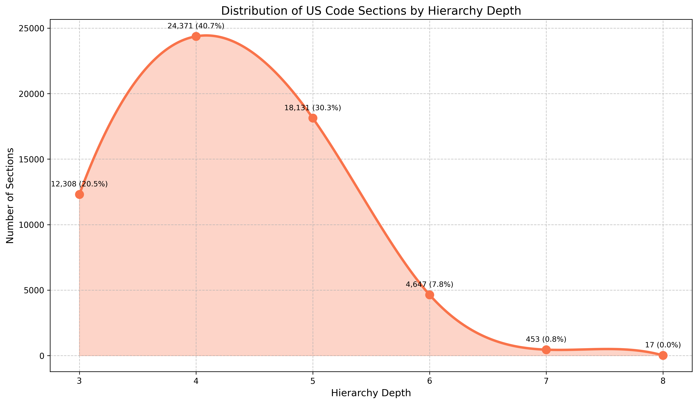
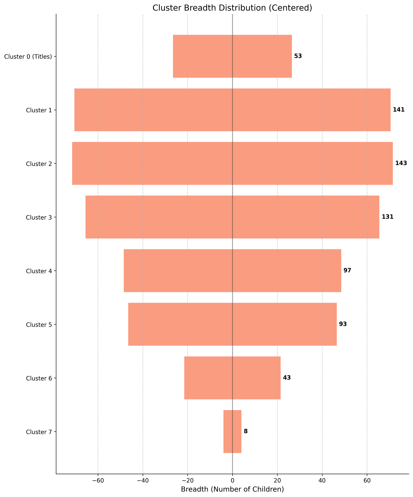

# Claude as a Juror

[US Code](https://uscode.house.gov/) dataset curation and prompting for a Claude.ai legal experiment using Clio.

Why the US Code? This legal corpus is the federal government's most organized hierarchy of laws currently in effect.

The final "cluster" dataset for use in Clio is located in `outputs/cluster_level_dataset_no_links.tsv`.

Here is a subsection of the legal code that demonstrates the nature of the hierarchy:

```
US Code
├── NAVIGATION AND NAVIGABLE WATERS
│   └── FLOOD CONTROL
│       └── Emergency response to natural disasters
│           ├── Permanent measures to reduce emergency flood fighting needs for communities subject to repetitive flooding
│           └── Monthly report to Congress
├── SHIPPING
│   └── Merchant Marine
│       └── Financial Assistance Programs
│           └── CABLE SECURITY FLEET
│               ├── Establishment of the Cable Security Fleet
│               └── Regulatory relief
└── TELECOMMUNICATIONS
    └── WIRE OR RADIO COMMUNICATION
        └── SPECIAL PROVISIONS RELATING TO RADIO
            └── Assistance for Planning and Construction of Public Telecommunications Facilities; Telecommunications Demonstrations; Corporation for Public Broadcasting; General Provisions
                └── assistance for planning and construction of public telecommunications facilities
                    ├── Criteria for approval and expenditures by Secretary
                    └── Declaration of purpose
```

`outputs/cluster_level_dataset.tsv` contains the same data but with paired columns for each level containing the URL pointing to the relevant section of the US Code.

Unlike the O*NET task clustering process the Anthropic team had to conduct using an LLM to generate a filtering hierarchy, the US legal code is already segmented into a wide range of thematically distinct categories and levels with descriptive names, although the depth of the hierarchy is not uniform. Some paths contain as few as three layers (Title, Chapter, Section), a plurality contains four (Title, Chapter, Subchapter, Section), and some contain up to eight (Title, Subtitle, Division, Appendix, Duplicate, Chapter, Subchapter, Section).

See more on the varying depths in `outputs/hierarchy_permutations.txt`.

The final dataset excludes any Sections that have been 'Repealed', 'Omitted', or 'Transferred', which make up 9,648 of the 60,636 total Sections, leaving us with 50,988 viable statutory Sections. This is ~2.5x the size of the full O*NET task dataset.

Unlike the O*NET task descriptions, the individual 'cluster names' here are notably short in length. `supplementary/analyze_cluster_breadth.py` calculates the maximum classification option count for each layer, with the highest being 143 options at any one point. This is a high number, but it's also only ~1,400 tokens at its peak, so these lists should not be prohibitively expensive to use in the classification prompts. See more of the distribution in `outputs/cluster_breadth_report.txt`.

There is a risk that this breadth of options as well as the depth of the hierarchy for a non-negligible subset of the legal domains (38.79% of paths have a depth of 5 or greater, while 8.54% have a depth of 6 or greater) increase the volume of LLM calls and input tokens significantly. This is worth analyzing more closely, but my initial impression is that the deepest paths have the narrowest set of options toward the end of the hierarchy, which mitigates the risk of struggling to contain the volume quite a bit. See `outputs/depth_analysis/hierarchy_depth_smooth.png` and `outputs/breadth_analysis/cluster_breadth_vertical.png` to visualize the distributions, or see the [Appendix](#appendix) section below.

## Prompts

Our experimental prompts are located in `prompts/`.

The first prompt `screener.md` is used to filter out non-legal conversations from the Claude dataset.

The second prompt `classification.md` is the crux of the experiment. It is used to map legal conversations to the appropriate domain at each level of the hierarchy, until we end up with the final statute. We can use the output of this method the same way the Economic Index uses clio_pct across O*NET tasks -- what are the legal domains users are discussing with AI?

The third prompt `common_vs_civil.md` is used to classify Claude's reasoning process betwene the two standard legal paradigms -- common law and civil law. These are two distinct approaches to legal thinking that use different mechanisms to arrive at a verdict -- common law uses precedent cases and analogous transfer, while civil law uses a direct assessment against existing statutes.

The fourth prompt `jury_score.md` is used to evaluate the accuracy of the assistant's legal advice in answering the user's question. This would be a post-classification process that feeds in the final statute and compares Claude's response to the text of the law itself or even a panel of jurors across newly unveiled cases.

## Motivations & Societal Impact
You can imagine a world in which people turn increasingly to AI in legal contexts (both to understand the law, but also potentially to determine whether somebody is in violation of it), which carries with it a series of fairly obvious risks. It is important that we understand these risks. 

This experiment gives us a clear framing for what these risks might look like -- first by understanding which domains are even in discussion between human beings and AI, and then consequently by understanding the statutory fidelity of the AI's judicial sensibilities. Even further, this framing can tell us how accurate the AI is across those different domains -- for example, if its reasoning is trustworthy in matters of agricultural law and not so much in matters of government employment standards. Finally, it gives us an understanding of whether LLMs reason through analogous thinking or through statutory assessment, and the proportion of each (and perhaps we experiment with different levels of input data or examples or number of turns), which will allow us to dissect the way AI might be used across these systems or in different countries that adopt one system over the other.

In theory, there is a future in which AI can root out human biases and act as a lucid peer to jurors or judges in court, serving as an impartial and highly intelligent thinking partner. But that future cannot come to exist for the betterment of society without our controlling for all of the negative consequences of outsourcing a rightfully human system of due process. And so this might serve as the conceptual foundation for understanding where we need to be careful.

You can hear me speak about the role of machine learning in court during my days as an undergrad at Harvard [here](https://youtu.be/rzGQzGNAmIE?si=gN552ZUyB21TvmuV). We've come a long way since then -- not only in terms of the development of LLMs and the world of novel questions we might ask about a computer's sense of judgment, but also in terms of a recent fluctuation in our society's commitment to ideas like due process and truth, and perhaps a realization that these things cannot be taken for granted, which makes this research more important now than ever before.

## Appendix
*Figure 1. Smoothed distribution of path-depths across all US Code hierarchies.*



*Figure 2. Vertical bar chart of maximum cluster options per level.*



## Project Structure

```
.
├── .env # Contains GovInfo API key from https://api.govinfo.gov/docs/
├── .gitignore # Git ignore file
├── README.md
├── main.py # Orchestrator to run fetch, hierarchy, clusters
├── scripts/ # Core processing scripts
│   ├── fetch_titles.py # Script to find latest US Code titles
|   ├── generate_hierarchy.py # Script to build US Code hierarchy
|   └── generate_clusters.py # Script to generate cluster datasets
├── utilities/ # Helper and analysis scripts
│   ├── analyze_cluster_breadth.py # Analyze cluster breadth
│   ├── analyze_hierarchy_permutations.py # Analyze hierarchy permutations
│   └── check_granule_count.py # Check and sum granule counts
└── outputs/ # Directory for storing processed data
    ├── latest_titles.json
    ├── title_summaries.json
    ├── uscode_hierarchy.json
    ├── cluster_level_dataset.tsv # Primary output with links
    ├── cluster_level_dataset_no_links.tsv # Primary output without links
    ├── granule_counts.json
    └── hierarchy_permutations.txt
```

## Usage

Follow the workflow sequence below to process and analyze legal data:

### Main Processing Scripts

run everything in one go:
```bash
python3 main.py
```
or step by step:
```bash
# Generate title information
python3 fetch_titles.py  # Generates outputs/latest_titles.json and outputs/title_summaries.json

# Generate hierarchy information
python3 generate_hierarchy.py  # Generates outputs/uscode_hierarchy.json

# Generate cluster datasets
python3 generate_clusters.py  # Generates cluster_level_dataset.tsv and cluster_level_dataset_no_links.tsv
```

### Supplementary Analysis Scripts (in utilities directory)
These scripts are not required for the main processing but can be used to analyze the generated data.

```bash
# Analyze cluster breadth
python3 analyze_cluster_breadth.py

# Analyze hierarchy permutations
python3 analyze_hierarchy_permutations.py

# Check granule counts
python3 check_granule_count.py  # Generates outputs/granule_counts.json
```

## License

MIT
